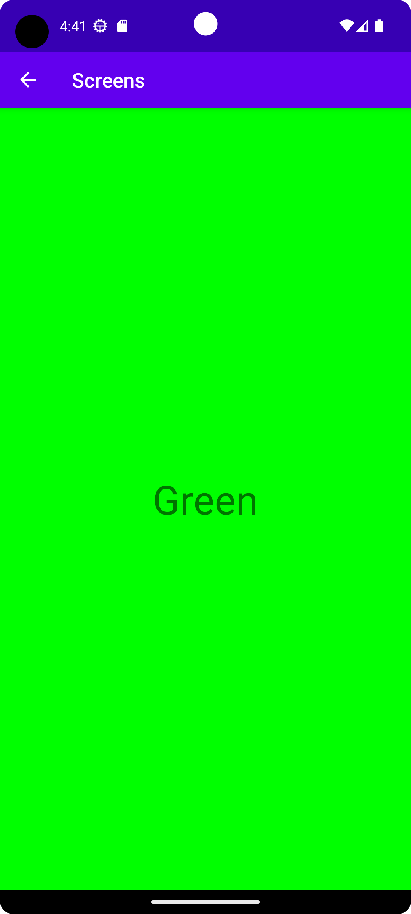

# Rapport
Added a new activity.

Added a button and spinner to MainActivity. The spinner needed it's own layout xml file in order to 
change properties of its text.

Used extras to insert a string from the spinner into the intent. Also added colors and added its id
using extras by matching the string as key in a hashmap. The button uses the intent when starting 
the second activity.

> String string = (String) spinner.getSelectedItem();  
> Intent intent = new Intent(MainActivity.this, ChildActivity.class);  
> intent.putExtra("string", string);  
> intent.putExtra("color", colorKey.get(string));  
> startActivity(intent);  

The second activity uses the intent to receive the string and color id. It displays the string in a 
TextView and uses the id to change the background color.

